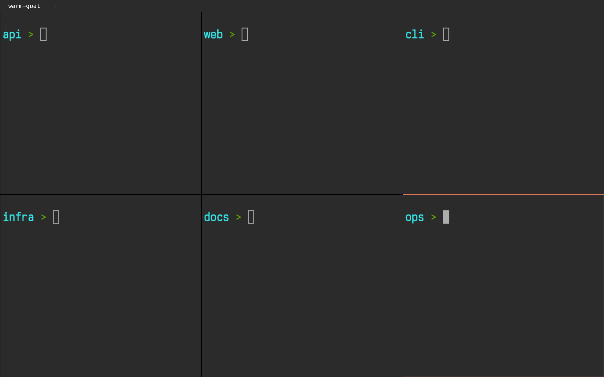

# ttyd-splits

Terminator-style terminal tabs and splits in the browser, served from your own
machine and reachable only inside your [Tailscale](https://tailscale.com)
network. One HTML file on top of [ttyd](https://github.com/tsl0922/ttyd). No
build step, no JavaScript dependencies.



Open `https://<machine>.<tailnet>.ts.net/splits` from a laptop, tablet, or
phone and you get real shells on your dev box, with the tab and split
keybindings you know from Terminator. The services come back on reboot
(launchd on macOS, systemd user units on Linux).

```
your browser --> https://<machine>.<tailnet>.ts.net
                    |  tailscale serve (tailnet-only TLS, WireGuard underneath)
                    |-- /        -> 127.0.0.1:7681  ttyd (terminal over WebSocket)
                    '-- /splits  -> 127.0.0.1:7690  python http.server (this UI)
```

The page iframes ttyd once per pane. Both routes share one tailnet origin, so
there is no CORS or auth plumbing to set up.

## Install

You need [Tailscale](https://tailscale.com/download) logged in on this machine
and on whatever device you browse from. On macOS the installer pulls in `ttyd`
via Homebrew; on Linux install it first (`sudo apt install ttyd`).

```sh
git clone https://github.com/al3rez/ttyd-splits
cd ttyd-splits
./install.sh
```

The installer:

1. copies `index.html` and `shell.sh` to `~/.ttyd-splits/`
2. sets up two always-on services bound to 127.0.0.1 only: `ttyd` on port
   7681 and `python3 -m http.server` on port 7690 (launchd agents on macOS,
   systemd user units on Linux)
3. runs `tailscale serve` to map `/` to ttyd and `/splits` to the UI over
   tailnet-only HTTPS

Then open `https://<machine>.<tailnet>.ts.net/splits`. The installer prints
the exact URL. Ports are configurable: `TTYD_PORT=8681 UI_PORT=8690 ./install.sh`.

On Linux, run `sudo loginctl enable-linger $USER` if you want the services up
without an active login session.

## Keybindings

| Keys | Action |
|---|---|
| `Ctrl+Shift+E` | split horizontally (side by side) |
| `Ctrl+Shift+O` | split vertically (stacked) |
| `Ctrl+Shift+W` | close focused pane (last pane closes the tab) |
| `Ctrl+Shift+T` | new tab |
| `Ctrl+Shift+←` / `→` | previous / next tab |
| `Ctrl+Shift+N` | new browser window |
| middle-click a tab | close it |

Tabs get random adjective-animal names. Click a pane to focus it (orange
ring). Shortcuts work while a terminal has focus.

## Customize

Create `~/.ttyd-splits/config.json` and reload the page. No service restart
needed, and updates never touch it:

```json
{
  "dirs": [
    "/Users/you/Work/project-a",
    "/Users/you/Work/project-b",
    "/Users/you/Work"
  ],
  "tabFont": "Menlo, monospace"
}
```

`dirs` lists the starting directories. The first tab opens one pane per entry
in rows of up to three, so six projects give you the 2x3 grid in the
screenshot. New splits and new tabs open in the last entry. Without a
config.json you get a single pane in `$HOME`. `tabFont` is optional and only
styles the tab bar.

Terminal font and size are ttyd client options (`-t fontFamily=...`,
`-t fontSize=...`) in `~/Library/LaunchAgents/local.ttyd.plist` or the systemd
unit. See `ttyd --help` for the rest.

`~/.ttyd-splits/shell.sh` decides what runs in each pane. The default is your
login shell in the requested directory.

Re-running `./install.sh` is safe. Your `config.json` is never overwritten,
and a customized `index.html` is backed up to `index.html.bak` first.

## Security model

This is an unauthenticated writable shell running as your user. It is safe
only because of how it is exposed:

- Both servers bind to 127.0.0.1, so nothing listens on your LAN.
- The only route in is `tailscale serve`, which is tailnet-only: devices must
  be authenticated to your own Tailscale network. Anyone on your tailnet gets
  a shell, so this assumes a personal or otherwise trusted tailnet.
- Never expose it with `tailscale funnel` (that is the public internet).
- To restrict which tailnet devices can reach these ports, use
  [Tailscale ACLs](https://tailscale.com/kb/1018/acls).

## Uninstall

```sh
./uninstall.sh          # removes services + tailscale serve paths
rm -rf ~/.ttyd-splits   # optional: remove UI files too
```

## License

MIT
